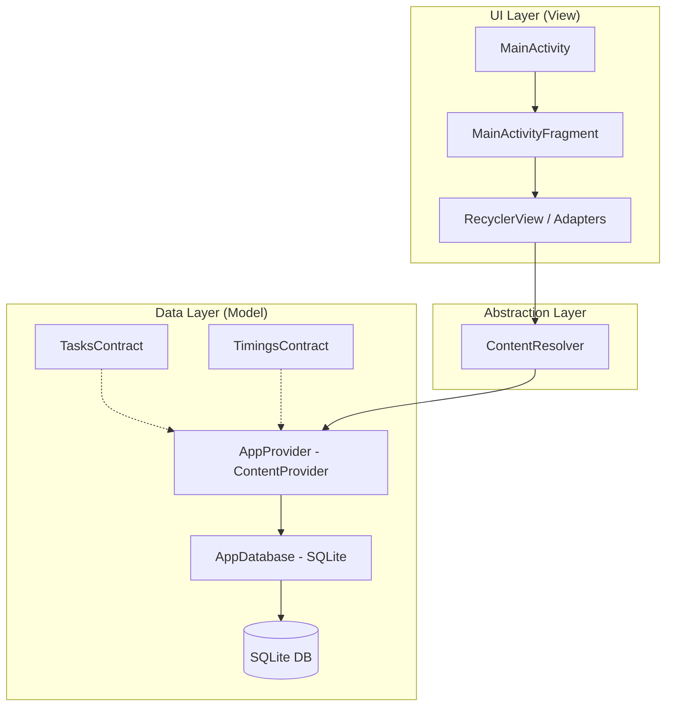
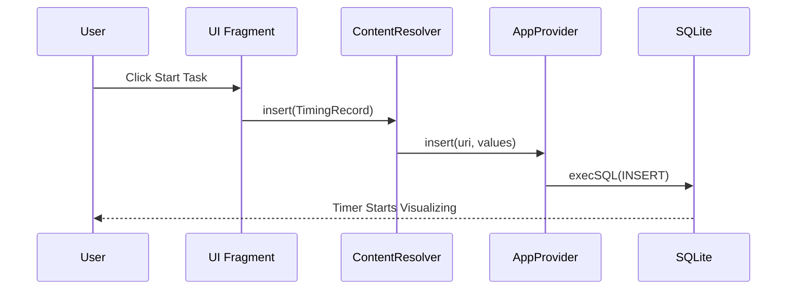

# ⏳ TaskTimerApp - Professional Productivity Tracker

**TaskTimerApp** is a sophisticated Android application designed for precision time tracking and task management. 
Built with **Kotlin** and leveraging core Android components, this app serves as a robust tool for anyone looking to optimize their workflow and gain insights into their time allocation.

[Overview](#-overview) • [Key Features](#-key-features) • [Architecture](#-architecture-and-design) • [MAD Score](#-mad-score)

---

## 📖 Overview

This project was developed as a comprehensive educational journey into the depths of Android development. It moves beyond simple "Hello World" apps to implement complex data management patterns, custom content providers, and deep database interactions. It showcases a commitment to learning the underlying mechanics of the Android OS.

### 🎯 Learning Objectives
- **Modern Kotlin**: Utilizing extensions, higher-order functions, and delegates.
- **Robust Persistence**: Custom `ContentProvider` over a normalized `SQLite` database.
- **UI Architecture**: Decoupling logic from views using industry-standard patterns.
- **Data Integrity**: Implementing complex SQL queries for real-time duration calculations.

---

## ✨ Key Features

### 📝 Task Management
* **Full CRUD Operations**: Create, Read, Update, and Delete tasks seamlessly.
* **Detailed Descriptions**: Attach notes and goals to each task.
* **Smart Sorting**: Prioritize your tasks with an integrated sort-order system.

### ⏱️ Precision Timing
* **Active Monitoring**: Start and stop timers with a single tap.
* **Data Integrity**: The app ensures that timing data is consistent, preventing overlapping sessions.
* **Persistence**: Timings are saved in real-time to prevent data loss.

### 📊 Insightful Reporting
* **Duration Analytics**: Automatically calculates total time spent per task.
* **Historical View**: Look back at your productivity over time.
* **Clean UI**: Reports are presented in an easy-to-read format.

---

## 🏗 Architecture and Design

### 🧬 High-Level Design Pattern
The app follows a structured approach that separates the UI from the data logic, ensuring maintainability and testability.

### 🔄 Data Lifecycle Sequence
The following sequence diagram illustrates how a timing session is recorded and persisted:

---

## 📊 MAD Score

TaskTimerApp is evaluated based on Google's Modern Android Development standards:

| Category | Technology | Score |
| :--- | :--- | :--- |
| **Language** | **Kotlin** - 100% Kotlin codebase using modern idioms. | ⭐⭐⭐⭐⭐ |
| **Architecture** | **Content Provider & SQLite** - Robust data sharing and storage. | ⭐⭐⭐⭐ |
| **UI** | **Material Components** - Following Material Design guidelines. | ⭐⭐⭐⭐ |
| **Jetpack** | **Core, Fragment, Lifecycle** - Utilizing modern Jetpack libs. | ⭐⭐⭐⭐ |

---

## 🛠 Tech Stack

- **Language**: [Kotlin](https://kotlinlang.org/) - Modern, safe, and expressive.
- **Database**: [SQLite](https://www.sqlite.org/index.html) - Robust local persistence.
- **Architecture**: **ContentProvider Pattern** - Standardized data interface.
- **UI Framework**: **Android Fragments & XML Layouts** - Classic, reliable UI construction.
- **Version Control**: Git - Industry standard for source tracking.

---

## 🚀 Future Roadmap

- [ ] **Jetpack Compose**: Modernize the UI layer with declarative components.
- [ ] **Room Persistence**: Migrate from raw SQLite to Room for better type safety.
- [ ] **Coroutines**: Enhance asynchronous operations for smoother UI.
- [ ] **Dark Mode**: Support for system-wide dark theme.
- [ ] **Unit Testing**: Implement comprehensive tests for the Data Layer.

---

## 👨‍💻 Author

**Barış Karapınar**
*Learning and Building for the Future.*

---
*Developed with passion as part of a professional Android Development curriculum.*
